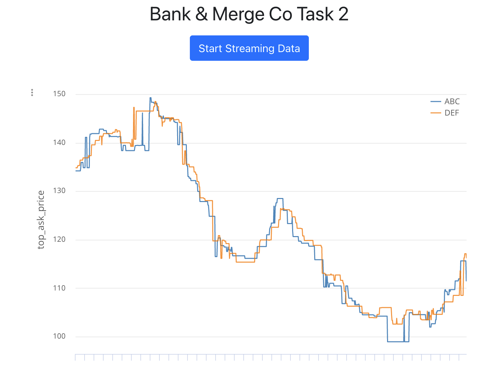

# JPMC Task 2

Starter repo for task 2 of JPMC's Forage program.

## Objectives

1. **Make the graph update continuously**
    - Serve a line graph where the y-axis is the stock’s `top_ask_price` and the x-axis is the stock’s `timestamp`.
    - Implement real-time data fetching to update the graph continuously.

2. **Remove duplicate data**
    - Ensure that duplicate data entries are disregarded to maintain the integrity of the displayed information.

## Installation

1. **Clone the repository:**
    ```bash
    git clone https://github.com/your-repo/jpmc-task-2.git
    cd jpmc-task-2
    ```

2. **Install dependencies:**
    ```bash
    conda create --name jpmc-task-2 python=3.8
    conda activate jpmc-task-2
    pip install -r requirements.txt
    ```

3. **Run the server:**
    ```bash
    python datafeed/server3.py
    ```

4. **Run the client:**
    Ensure you have a development server like `npm start` or similar to serve the client application.

